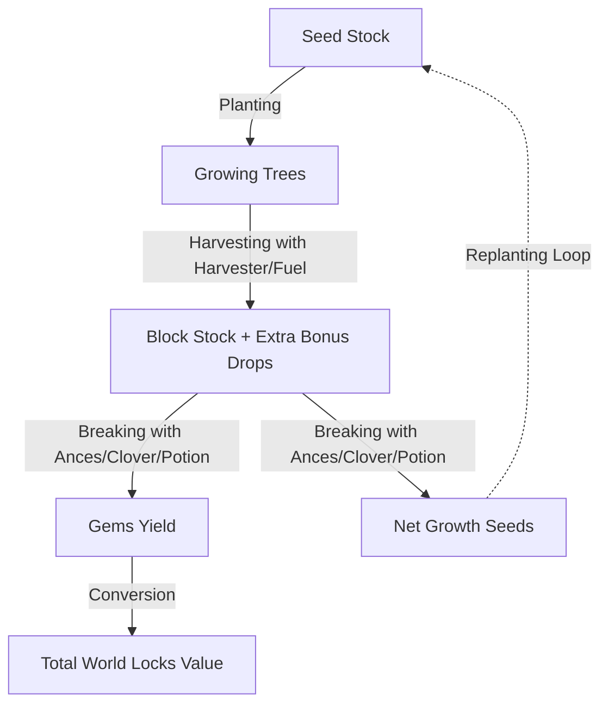

# ⛏️ Growtopia Farm Calculator Pro (ib Erwinher)

<p align="center">
  
  
  
  
</p>

<p align="center">
  🌐 <strong>Live Playable Website:</strong><br>
  👉 <a href="https://olyxmintabansos-byte.github.io/Growtopia-Calculator-ib-Erwinher/" target="_blank"><strong>https://olyxmintabansos-byte.github.io/Growtopia-Calculator-ib-Erwinher/</strong></a>
</p>

---

> **Kalkulator Pertanian (*Farming*) All-in-One Growtopia Terlengkap — Menghitung Drop Gems, Pertumbuhan Benih, Pengali Harvester of Sorrows, Level Ancestral Tesseract, Hingga Simulasi Siklus Panen Penuh.**

Diadaptasi dan dikembangkan dari ide orisinal Erwinher, **Growtopia Farm Calculator Pro** dirancang ulang oleh Olyx dengan antarmuka gelap modern, penghitungan presisi tingkat lanjut, serta dukungan multi-item *farmable* terpopuler (Pepper Tree, Laser Grid, Chandelier, Sorcerer Stone, dll).

---

## 📑 Daftar Isi

- [Diagram Siklus Pertanian](#-diagram-siklus-pertanian)
- [Fitur Utama](#-fitur-utama)
- [Preset Farmable & Multiplier](#-preset-farmable--multiplier)
- [Struktur Folder](#-struktur-folder)
- [Cara Menjalankan Secara Lokal](#-cara-menjalankan-secara-lokal)
- [Lisensi & Atribusi](#-lisensi--atribusi)

---

## 🔄 Diagram Siklus Pertanian



---

## ✨ Fitur Utama

### 1. 🔨 Break Only Calculator
- **Preset Item Cepat:** Pepper Tree, Laser Grid, Chandelier, Pinball, dll.
- **Dukungan Ancestral Tesseract (Level 0 – 5):** Menghitung probabilitas bonus gem tambahan.
- **Konsumsi Item Pendukung:**
  - 🍀 **Lucky Clover** (+Drop Gems).
  - 🤖 **Buddy Head**.
  - ⭐ **Wishing Star**.
  - 🧪 **Guild Potion** (+20% Gems).
- **Konversi Otomatis:** Mengubah estimasi total perolehan gems ke nilai World Lock (WL) berdasarkan kurs saat ini.

### 2. 🌾 Harvest Only Calculator
- Menghitung hasil panen pohon menggunakan **Harvester of Sorrows** atau **Fuel Pack** bonus multipliers.
- Estimasi waktu panen manual berdasarkan jumlah pohon di dalam world.

### 3. 🚜 Full Cycle Simulation (Plant ➔ Harvest ➔ Break)
- Melacak persentase pertumbuhan netto bibit (*seed profit margin*).
- Menghitung keuntungan kumulatif gems dan bibit per rotasi tanam-panen-pecah.

---

## 🌾 Preset Farmable & Multiplier

| Item Farmable | Rata-rata Gems / Block | Waktu Tumbuh | Karakteristik |
|---|:---:|:---:|---|
| **Pepper Tree** | $\sim 2.0$ | 1 hari 8 jam | Cepat panen, stabil untuk pemula |
| **Laser Grid** | $\sim 2.4$ | 3 hari 2 jam | Favorit farmer menengah & efisien |
| **Chandelier** | $\sim 3.8$ | 7 hari 4 jam | Drop gems tertinggi per balok |

---

## 📁 Struktur Folder

```text
Growtopia-Calculator-ib-Erwinher/
├── index.html          # Antarmuka kalkulator pertanian & form konfigurasi
├── script.js           # Engine matematika kalkulasi break, harvest & cycle
├── style.css           # Styling dark mode Tailwind
└── README.md           # Dokumentasi resmi
```

---

## 🚀 Cara Menjalankan Secara Lokal

1. **Clone repositori:**
   ```bash
   git clone https://github.com/olyxmintabansos-byte/Growtopia-Calculator-ib-Erwinher.git
   cd Growtopia-Calculator-ib-Erwinher
   ```
2. **Buka di Browser:**
   Buka file `index.html` langsung di peramban favorit Anda.

---

## 📝 Lisensi & Atribusi

Terinspirasi oleh karya Erwinher • Dirancang ulang & direkayasa © 2026 **Olyx** ([@olyxmintabansos-byte](https://github.com/olyxmintabansos-byte)).  
Dilisensikan di bawah naungan **[MIT License](LICENSE)**.
